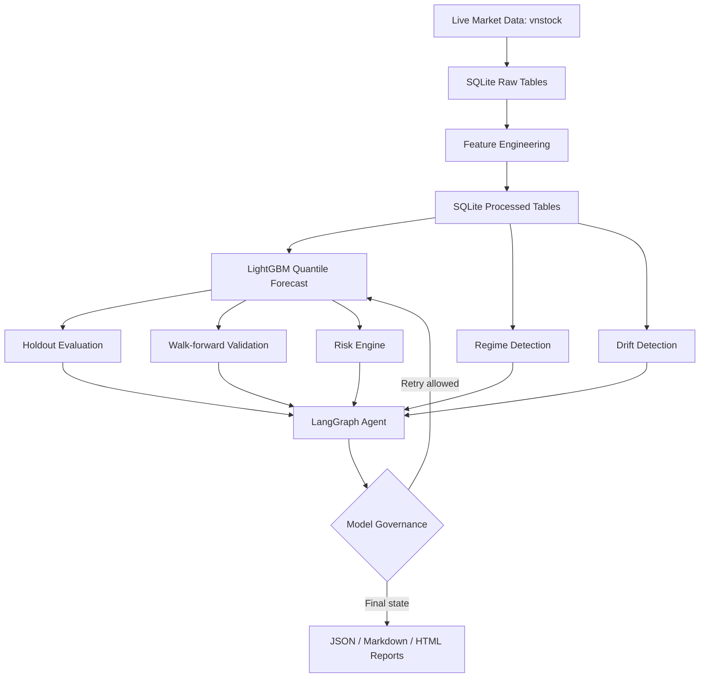

# Agentic Vingroup Quant Forecasting System

## 1. Project Overview

Agentic Vingroup Quant Forecasting System is an end-to-end research pipeline for forecasting short-horizon price scenarios for selected Vingroup-related Vietnamese equities.

The system ingests daily OHLCV data for `VIC`, `VHM`, `VRE`, and `VPL`, adds market context from `VN30` and `VN30F1M`, stores the data locally in SQLite, engineers technical features, trains LightGBM quantile models, validates the forecasts, detects market regime and drift, computes a research-only risk signal, and generates structured reports.

The agent layer is implemented with LangGraph and Gemini through `langchain-google-genai`. It acts as a Quantitative Risk Committee / Model Governance Reviewer rather than an autonomous trader. It can evaluate model status, scan structured news context, run a limited retrain loop, apply champion/challenger governance checks, and produce a final research signal.

This project is built for assessment and research demonstration. It does not connect to a broker, does not place real trades, and should not be interpreted as financial advice.

## 2. Why This Project?

This project is relevant for a Quantitative Researcher home test because it combines several skills that matter in real quant/ML research workflows:

- Time-series ingestion from live market data APIs.
- Local data persistence and reproducible data processing.
- Feature engineering for equity time series.
- Probabilistic forecasting using quantile regression.
- Multi-horizon 7-day forecast generation.
- Holdout evaluation and walk-forward validation.
- Regime and drift monitoring.
- Risk-aware signal generation instead of naive point prediction.
- Agentic model evaluation using LangGraph and Gemini.
- A controlled model improvement loop with champion/challenger checks.
- Structured JSON, Markdown, and HTML reports for review.

The system is intentionally practical: it tries to answer not only "what is the forecast?" but also "how reliable is the forecast?", "has the data regime changed?", "should the model output be trusted?", and "what should be reviewed manually?"

## 3. System Architecture

```text
Live Market Data
    -> Data Quality / SQLite Storage
    -> Feature Engineering
    -> Forecast Model
    -> Holdout Evaluation
    -> Walk-forward Validation
    -> Regime / Drift Detection
    -> Risk Engine
    -> LangGraph Agent
    -> Governance / Improvement Loop
    -> Report Output
```

Mermaid view:



## 4. Data Sources

| Data | Source | Purpose |
|---|---|---|
| `VIC` | vnstock daily OHLCV | Main default target ticker in `main.py`. |
| `VHM` | vnstock daily OHLCV | Vingroup stock universe member; processed and stored. |
| `VRE` | vnstock daily OHLCV | Vingroup stock universe member; processed and stored. |
| `VPL` | vnstock daily OHLCV | Vingroup stock universe member; processed and stored. |
| `VN30` | vnstock daily OHLCV, `data_type="index"` | Broad market context features. |
| `VN30F1M` | vnstock daily OHLCV, `data_type="derivative"` | Futures market context features. |
| Vietstock RSS | `feedparser` over Vietstock RSS feeds | News/event context for abnormal model conditions. |

Current implementation note: the code fetches and processes all Vingroup tickers, but `main.py` currently runs the full agent/report pipeline for `target_ticker="VIC"`.

## 5. Folder Structure

```text
configs/      YAML configuration for model and agent thresholds.
data/         Local SQLite database and placeholder raw/processed folders.
docs/         Detailed human documentation.
logs/         Runtime logs written by utils/logger.py.
models/       Present but not used for persisted model artifacts in current code.
notebooks/    Blueprint/workflow notebooks, not required for runtime.
reports/      Generated JSON, Markdown, and HTML outputs.
src/          Main source code.
tests*.py     Smoke scripts for ingestion, processing, modeling, validation, agent, and monitoring/risk.
utils/        Logger and small helper functions.
```

Important source subfolders:

```text
src/ingestion/    vnstock data fetch.
src/processing/   feature engineering and SQLite storage.
src/modeling/     LightGBM quantile model and validation.
src/monitoring/   regime and drift detectors.
src/risk/         risk engine and preliminary signal rules.
src/agent/        LangGraph agent, Gemini prompts, governance loop.
src/reporting/    JSON/Markdown/HTML report generation.
```

## 6. End-to-End Pipeline Flow

### 1. Load config and environment

`main.py` loads `.env`, checks for `GOOGLE_API_KEY`, initializes logging, and creates a short `run_id`.

### 2. Fetch data

`get_vingroup_and_context_data` pulls approximately two years of daily data for:

- `VIC`, `VHM`, `VRE`, `VPL`
- `VN30`
- `VN30F1M`

### 3. Save raw data

`process_and_save_data` saves raw tables to SQLite:

```text
raw_VIC, raw_VHM, raw_VRE, raw_VPL, raw_VN30, raw_VN30F1M
```

### 4. Generate features

For each stock, `generate_technical_features` creates return, volume, technical, calendar, and lag features. `generate_context_features` creates VN30/VN30F1M context features and joins them by date.

### 5. Save processed data

Processed tables are saved as:

```text
processed_VIC, processed_VHM, processed_VRE, processed_VPL
```

### 6. Train/evaluate model

`generate_7_day_forecast` creates a `QuantileLightGBM` trainer, runs holdout evaluation, runs walk-forward validation, and trains quantile models for each horizon.

### 7. Generate forecast

The system forecasts 7 horizons:

```text
T+1, T+2, T+3, T+4, T+5, T+6, T+7
```

For each horizon, it outputs:

```text
q_0.025, q_0.1, q_0.5, q_0.9, q_0.975
```

### 8. Run walk-forward validation

`run_walk_forward_validation` evaluates time-series folds with expanding training windows and no random split.

### 9. Detect regime

`detect_regime` labels volatility, trend, and liquidity conditions.

### 10. Detect drift

`detect_drift` compares older reference data with recent current data and checks feature, target, and concept drift.

### 11. Run risk engine

`calculate_risk_report` turns forecast quantiles into expected return, downside risk, VaR, expected shortfall, risk/reward ratio, risk level, signal confidence, and preliminary research signal.

### 12. Invoke LangGraph Agent

The agent validates quantile ordering, evaluates model status, scans news if needed, runs retrain if configured, applies champion/challenger governance, and produces a final research summary.

### 13. Retrain if needed

If model MAPE exceeds `thresholds.max_mape`, the graph routes through news contextualization and the improvement node.

### 14. Governance / rollback

The challenger is accepted only if governance gates pass. If the challenger fails, the champion forecast and backed-up config are retained.

### 15. Generate reports

`generate_reports` writes JSON, Markdown, and HTML reports.

## 7. Feature Engineering

Feature engineering is implemented in `src/processing/features.py` and connected in `src/processing/cleaner.py`.

### Feature groups

| Group | Features |
|---|---|
| Raw price/volume | `open`, `high`, `low`, `close`, `volume` |
| Return/volume changes | `daily_return`, `vol_change` |
| Moving averages | `ma_7`, `ma_14` |
| Volatility | `volatility_7`, `atr_14` |
| Technical indicators | `rsi_14`, `macd`, `roc_7` |
| Calendar | `day_of_week`, `month` |
| Lag features | `close_lag_1`, `return_lag_1`, `close_lag_3`, `return_lag_3`, `close_lag_7`, `return_lag_7`, `close_lag_14`, `return_lag_14` |
| Market context | `vn30_return`, `vn30_close`, `vn30f_return`, `vn30f_close` |
| Cross-stock features | Not implemented in current code |

### Feature inventory

Model usage rule: the model uses every processed DataFrame column except `ticker`, `date`, and transient `target`. In the current processed tables, that means 28 model input columns.

| Feature | Logic | Used by model | Simple explanation |
|---|---|---|---|
| `open` | Raw open price | yes | Opening daily price. |
| `high` | Raw high price | yes | Highest daily price. |
| `low` | Raw low price | yes | Lowest daily price. |
| `close` | Raw close price | yes | Closing daily price and target base. |
| `volume` | Raw volume | yes | Trading activity. |
| `daily_return` | `close.pct_change()` | yes | One-day price return. |
| `vol_change` | `volume.pct_change()` | yes | One-day volume change. |
| `ma_7` | 7-day rolling average of close | yes | Short-term trend level. |
| `ma_14` | 14-day rolling average of close | yes | Slightly longer trend level. |
| `volatility_7` | 7-day std of daily return | yes | Recent volatility. |
| `rsi_14` | 14-day RSI | yes | Momentum / overbought-oversold indicator. |
| `macd` | MACD line | yes | Trend/momentum indicator. |
| `atr_14` | 14-day Average True Range | yes | Range-based volatility. |
| `roc_7` | 7-day Rate of Change | yes | Recent momentum. |
| `day_of_week` | Date index weekday | yes | Calendar effect. |
| `month` | Date index month | yes | Monthly seasonality. |
| `close_lag_1` | Close shifted by 1 | yes | Yesterday close. |
| `return_lag_1` | Return shifted by 1 | yes | Yesterday return. |
| `close_lag_3` | Close shifted by 3 | yes | Close 3 days ago. |
| `return_lag_3` | Return shifted by 3 | yes | Return 3 days ago. |
| `close_lag_7` | Close shifted by 7 | yes | Close 7 days ago. |
| `return_lag_7` | Return shifted by 7 | yes | Return 7 days ago. |
| `close_lag_14` | Close shifted by 14 | yes | Close 14 days ago. |
| `return_lag_14` | Return shifted by 14 | yes | Return 14 days ago. |
| `vn30_return` | VN30 close percent change | yes | Broad market return context. |
| `vn30_close` | VN30 close | yes | Broad market level. |
| `vn30f_return` | VN30F1M close percent change | yes | Futures market return context. |
| `vn30f_close` | VN30F1M close | yes | Futures market level. |

## 8. Forecasting Model

### What is LightGBM?

LightGBM is a gradient boosting decision tree library. It builds many small decision trees sequentially, where each new tree tries to improve the errors of the previous trees. It is commonly used for tabular data because it handles nonlinear relationships and feature interactions well.

### What is quantile regression?

Standard regression usually predicts one expected value. Quantile regression predicts a point in the distribution, such as:

- 2.5th percentile: severe downside scenario
- 10th percentile: lower 80% interval bound
- 50th percentile: median forecast
- 90th percentile: upper 80% interval bound
- 97.5th percentile: upper 95% interval bound

This project uses quantile regression so it can produce uncertainty bands, not only a single price forecast.

### Forecast horizon

The project uses direct multi-step forecasting:

```text
step = 1, 2, 3, 4, 5, 6, 7
```

For each step, the model creates a horizon-specific target and trains quantile models.

### Does the model predict return or price?

The model trains on future return:

```text
target = (close[t + step] - close[t]) / close[t]
```

Then it converts the predicted return back into a price forecast:

```text
predicted_price = current_close * (1 + predicted_return)
```

### Quantile crossing

Quantile crossing happens when the model predicts impossible ordering, for example:

```text
q_0.1 > q_0.5
```

`node_validate` sorts the quantile values per horizon so that:

```text
q_0.025 <= q_0.1 <= q_0.5 <= q_0.9 <= q_0.975
```

## 9. Model Evaluation Metrics

### MAE

Formula:

```text
mean(abs(actual_price - predicted_price))
```

Meaning: average absolute price error. Lower is better. Used in holdout and walk-forward validation.

### RMSE

Formula:

```text
sqrt(mean((actual_price - predicted_price)^2))
```

Meaning: similar to MAE but penalizes large errors more strongly. Lower is better. Used in validation and governance.

### MAPE

Formula:

```text
mean(abs(error) / abs(actual_price))
```

Meaning: average percentage error. Lower is better. Used by `node_evaluate` to decide `PASS` vs `ABNORMAL`.

### SMAPE

Formula:

```text
mean(2 * abs(error) / (abs(actual) + abs(predicted)))
```

Meaning: symmetric percentage error. Lower is better. Computed in walk-forward validation.

### Directional Accuracy

Formula:

```text
mean(sign(actual_price - current_price) == sign(predicted_price - current_price))
```

Meaning: how often the model predicts the correct up/down direction. Higher is better. Used in governance and risk confidence.

### Interval Coverage

80% interval coverage checks whether actual prices fall between `q_0.1` and `q_0.9`.

95% interval coverage checks whether actual prices fall between `q_0.025` and `q_0.975`.

Higher is usually better up to the intended confidence level, but too-wide intervals can be uninformative. In this project, low coverage is treated as a calibration concern.

### Pinball Loss

Pinball loss is the standard loss for quantile forecasts. It penalizes forecasts asymmetrically depending on whether the actual value is above or below the quantile. Lower is better.

### Prediction Bias

Formula:

```text
mean(predicted_price - actual_price)
```

Meaning: average signed error. Positive bias means overprediction; negative bias means underprediction.

## 10. Walk-Forward Validation

Time-series data should not be randomly split because random splits leak future information into the training set. A model trained on future observations would look artificially good.

Walk-forward validation respects time order:

1. Train on an initial historical window.
2. Validate on the next time window.
3. Move forward.
4. Repeat until the configured number of windows is reached.

Current config is read from `configs/model_config.yaml`:

```yaml
walk_forward_validation:
  horizon: 1
  initial_train_size: 252
  validation_window: 20
  step_size: 20
  max_windows: 8
```

So the intended validation setup is up to 8 folds, using 20-row validation windows, with an expanding history. Actual fold count may be lower if data is insufficient.

Outputs include:

- MAE
- RMSE
- MAPE
- SMAPE
- Directional Accuracy
- Interval Coverage 80%
- Interval Coverage 95%
- Pinball Loss
- Prediction Bias
- Quantile Crossing Rate

## 11. Market Regime Detection

Implemented in `src/monitoring/regime_detector.py`.

### Volatility regime

The system calculates recent 20-day volatility from daily returns and compares it with the historical rolling volatility distribution.

Labels:

```text
LOW_VOLATILITY
NORMAL_VOLATILITY
HIGH_VOLATILITY
EXTREME_VOLATILITY
```

### Trend regime

The system compares:

- MA7 vs MA21 gap
- 20-day return
- 5-day return

Labels:

```text
UPTREND
DOWNTREND
SIDEWAYS
REVERSAL_RISK
```

### Liquidity regime

The system checks recent volume against a 60-day volume mean/std.

Labels:

```text
NORMAL_LIQUIDITY
LOW_LIQUIDITY
VOLUME_SPIKE
```

Regime output is used by the risk engine and included in the agent state/report.

## 12. Drift Detection

Implemented in `src/monitoring/drift_detector.py`.

### Feature drift

The detector compares selected numeric features between a reference window and recent current window using:

- mean shift z-score
- standard deviation ratio
- PSI

### Target drift

The detector compares close-to-close return behavior between reference and current windows.

### Concept drift

The detector checks validation metrics:

- high MAPE
- weak directional accuracy
- low 95% interval coverage

### Severity

Output severity:

```text
LOW
MEDIUM
HIGH
```

High drift can force the risk engine into `MANUAL_REVIEW`.

## 13. Risk Engine

Implemented in `src/risk/risk_engine.py`.

The risk engine is research-only. It does not send orders and does not connect to any broker.

### Inputs

- Forecast quantiles from `forecast_data`
- Walk-forward validation metrics
- Regime report
- Drift report

### Metrics

| Metric | Meaning |
|---|---|
| `expected_return_7d` | Median T+7 forecast return vs current price. |
| `downside_risk_95` | Downside estimate from T+7 `q_0.025`. |
| `upside_potential_95` | Upside estimate from T+7 `q_0.975`. |
| `var_95` | 95% value-at-risk approximation from lower quantile. |
| `expected_shortfall` | Simple approximation: `VaR_95 * 1.15`. |
| `risk_reward_ratio` | Upside potential divided by downside risk. |
| `signal_confidence` | Heuristic confidence based on validation, coverage, risk, and drift. |

### Signals

Allowed research signals:

```text
BUY
SELL
HOLD
WATCH
MANUAL_REVIEW
```

High drift, extreme volatility, invalid data, or low liquidity can force `MANUAL_REVIEW`. Positive expected return with acceptable risk/reward can produce `BUY`. Strong negative expected return or large downside can produce `SELL` or `WATCH`. Otherwise the system uses `HOLD`.

This is a research signal only, not financial advice.

## 14. LangGraph Agent Workflow

The agent acts as:

- Quantitative Risk Committee Agent
- Model Governance Reviewer
- Market Context Analyst

It is not an autonomous trader.

### Where Gemini is used

Gemini is initialized lazily in `src/agent/nodes.py`:

```python
ChatGoogleGenerativeAI(
    model="gemini-3.1-flash-lite-preview",
    temperature=0.2
)
```

It is used in:

- `_invoke_context_committee`
- `_invoke_recommendation_committee`

If no news is found, context classification is set to `NO_NEWS` without asking the LLM to invent a narrative.

### Agent reads

The agent reads:

- forecast data
- holdout metrics
- walk-forward metrics
- regime report
- drift report
- risk report
- news evidence
- governance state

### Agent outputs

The agent updates:

- `evaluation_status`
- `evaluation_reason`
- `news_context`
- `news_found`
- `evidence_level`
- `shock_type`
- `governance_decision`
- `trading_signal`
- `signal_confidence`
- `final_recommendation`
- `audit_trail`

### Node diagram

```text
node_validate
  -> node_evaluate
      -> node_recommend
      -> node_contextualize
          -> node_improve
              -> node_validate
              -> node_recommend
```

### Shock types

```text
NO_NEWS
TREND_SHIFT
EVENT_DRIVEN
BLACK_SWAN
DATA_ISSUE
MODEL_DEGRADATION
```

## 15. Champion / Challenger and Governance

The current forecast is treated as the champion. A retrained forecast is treated as the challenger.

### When retrain happens

Retrain is triggered when `node_evaluate` marks the model as `ABNORMAL`, based on holdout MAPE exceeding `thresholds.max_mape`.

### What the agent can change

`tool_adjust_model_hyperparams` can adjust:

- `max_depth`
- `learning_rate`
- `n_estimators`
- `num_leaves`

It writes changes to `configs/model_config.yaml`.

### Acceptance gates

The challenger is accepted only if:

- MAPE improves.
- Directional accuracy does not degrade by more than 0.03.
- 95% interval coverage does not degrade by more than 0.08.
- RMSE does not worsen by more than 10%.

This is important because a challenger can reduce MAPE while becoming worse calibrated or directionally weaker. The project therefore does not promote a model solely because MAPE improved.

### Rollback

If the challenger fails governance gates, the backed-up model config is restored and the champion forecast is retained.

## 16. Report Outputs

Reports are generated in `src/reporting/generator.py`.

### JSON

Path:

```text
reports/json/{ticker}_report_{YYYY-MM-DD}.json
```

Use case: machine-readable full state, risk report, governance decision, metrics, and audit trail.

### Markdown

Path:

```text
reports/markdown/{ticker}_report_{YYYY-MM-DD}.md
```

Use case: human-readable Quant Risk Committee report.

### HTML

Path:

```text
reports/html/{ticker}_report_{YYYY-MM-DD}.html
```

Use case: browser report with summary panels and a Plotly fan chart.

### Logs

Path:

```text
logs/{YYYY-MM-DD}_system.log
```

## 17. How to Run

Windows PowerShell example:

```powershell
python -m venv .venv
.\.venv\Scripts\Activate.ps1
pip install -r requirements.txt
```

Create `.env`:

```powershell
Set-Content .env "GOOGLE_API_KEY=your_google_api_key_here"
```

Run the pipeline:

```powershell
python main.py
```

Run smoke checks:

```powershell
python test_validation.py
python test_monitoring_risk.py
python -X utf8 test_modeling.py
```

Network access is required for vnstock ingestion, Vietstock RSS, and Gemini API calls.

## 18. Configuration

### `configs/model_config.yaml`

Controls LightGBM and walk-forward validation:

```yaml
lightgbm_params:
  boosting_type: gbdt
  learning_rate: ...
  max_depth: ...
  n_estimators: ...
  num_leaves: ...
  random_state: 42
  verbose: -1

walk_forward_validation:
  initial_train_size: 252
  validation_window: 20
  step_size: 20
  max_windows: 8
  horizon: 1
```

Current implementation note: `configs/model_config.yaml` may be modified by the agent retrain loop. Inspect it before a final run.

### `configs/agent_config.yaml`

Controls:

- `thresholds.max_mape`
- `thresholds.max_retries`
- prompt placeholders

Current implementation note: the assessment description mentions a deliberately strict 1% MAPE threshold to demonstrate the retrain loop. The current working copy inspected here has `max_mape: 0.03`. The YAML file is the runtime source of truth. If the assessment must demonstrate the 1% threshold, review this config manually before running.

### `risk_config.yaml`

No separate `risk_config.yaml` exists in the current codebase. Risk thresholds are hard-coded in `src/risk/risk_engine.py`.

## 19. Example Terminal Output

Representative output:

```text
Pipeline started | run_id=68f6d42e | ticker=VIC
Data fetch completed | symbol=VIC | rows=498
Feature engineering completed | symbol=VIC | rows_dropped=26 | rows_final=472
Holdout evaluation completed | ticker=VIC | mae=5097.50 | rmse=6545.87 | mape=0.0281
Walk-forward validation complete: folds=8, MAE=4025.9632, RMSE=5384.1549, MAPE=0.0285
Regime report generated | volatility=NORMAL_VOLATILITY | trend=UPTREND | liquidity=NORMAL_LIQUIDITY
Drift report generated | severity=HIGH | feature_drift=True | target_drift=False | concept_drift=False
Risk report generated | signal=MANUAL_REVIEW | confidence=0.44 | expected_return_7d=-0.0067
Model evaluation completed | ticker=VIC | status=ABNORMAL | holdout_mape=0.0281
Governance decision | ticker=VIC | decision=KEEP_CHAMPION
Final research signal | ticker=VIC | signal=MANUAL_REVIEW | confidence=0.44
Pipeline completed successfully | ticker=VIC | final_signal=MANUAL_REVIEW
Reports saved | paths={'json': 'reports\\json\\VIC_report_YYYY-MM-DD.json', ...}
```

## 20. Example JSON Output

Short illustrative example:

```json
{
  "ticker": "VIC",
  "evaluation_status": "ABNORMAL",
  "forecast_data": {
    "current_price": 222000.0,
    "metrics": {
      "MAE": 5097.49,
      "RMSE": 6545.86,
      "MAPE": 0.0281
    },
    "forecasts": [
      {
        "step": 1,
        "q_0.025": 207000.0,
        "q_0.1": 214000.0,
        "q_0.5": 222000.0,
        "q_0.9": 233000.0,
        "q_0.975": 236000.0
      }
    ]
  },
  "regime_report": {
    "volatility_regime": "NORMAL_VOLATILITY",
    "trend_regime": "UPTREND",
    "liquidity_regime": "NORMAL_LIQUIDITY"
  },
  "drift_report": {
    "severity": "HIGH",
    "recommended_action": "MANUAL_REVIEW"
  },
  "risk_report": {
    "preliminary_signal": "MANUAL_REVIEW",
    "signal_confidence": 0.44,
    "risk_level": "EXTREME"
  },
  "trading_signal": "MANUAL_REVIEW"
}
```

## 21. Limitations

- The model is not intended to predict prices perfectly.
- Free/public market APIs can be incomplete, delayed, or unstable.
- Vietstock RSS is a limited news source and may miss important events.
- The LLM is constrained by provided state and should not be treated as a source of truth.
- No broker integration exists.
- Signals are research/paper-trading signals only.
- No transaction cost model is implemented.
- No portfolio-level backtest is implemented.
- No Sharpe ratio, max drawdown, or win-rate module is implemented.
- Model artifacts are not persisted.
- Current risk thresholds are hard-coded in `risk_engine.py`.
- The strict MAPE threshold described for assessment is a demo mechanism, not a calibrated production threshold.

## 22. Future Improvements

Possible next steps:

- Add a feature store or versioned dataset snapshots.
- Persist trained model artifacts.
- Add MLflow or another experiment tracking system.
- Add richer event calendars and corporate action data.
- Add higher-quality news sources with timestamps and source ranking.
- Add portfolio-level backtesting.
- Add transaction cost and liquidity impact modeling.
- Add hyperparameter optimization.
- Move risk thresholds into config.
- Add Docker deployment.
- Add CI tests for core modules.
- Add model explainability reports such as feature importance and SHAP.
- Add a persistent champion model registry.

## 23. Assessment Mapping

| Home Test Requirement | Implemented Component |
|---|---|
| Live data ingestion | `src/ingestion/vnstock_api.py` fetches vnstock OHLCV. |
| Vingroup stock universe | `VIC`, `VHM`, `VRE`, `VPL` are fetched and processed. |
| Market context | `VN30` and `VN30F1M` context features. |
| Local storage | SQLite via `src/processing/db_manager.py`. |
| Feature engineering | `src/processing/features.py`. |
| Forecast next 7 days | `generate_7_day_forecast` in `src/modeling/predictor.py`. |
| Probabilistic forecasts | LightGBM quantile outputs at 2.5%, 10%, 50%, 90%, 97.5%. |
| Confidence intervals | 80% and 95% quantile bands. |
| Holdout metrics | `QuantileLightGBM.evaluate_holdout`. |
| Walk-forward validation | `src/modeling/validation.py`. |
| Market regime detection | `src/monitoring/regime_detector.py`. |
| Drift detection | `src/monitoring/drift_detector.py`. |
| Risk-aware signal | `src/risk/risk_engine.py`. |
| AI Agent Evaluator | LangGraph workflow in `src/agent/graph.py` and `src/agent/nodes.py`. |
| Gemini integration | `ChatGoogleGenerativeAI` in `src/agent/nodes.py`. |
| News/context handling | `tool_search_vietstock_news` in `src/agent/tools.py`. |
| Feedback improvement loop | `node_improve` adjusts config and retrains. |
| Champion/challenger governance | `_compare_champion_challenger` in `src/agent/nodes.py`. |
| Rollback behavior | Rejected challenger restores backed-up model config. |
| JSON report | `reports/json/...` via `src/reporting/generator.py`. |
| Markdown report | `reports/markdown/...` via `src/reporting/generator.py`. |
| HTML report | `reports/html/...` with Plotly fan chart. |
| Audit trail | `audit_trail` in `AgentState` and reports. |

## Additional Documentation

- `docs/CODEBASE_REVIEW.md`: detailed codebase inventory.
- `docs/METRICS_GUIDE.md`: Vietnamese guide to metrics.
- `docs/PIPELINE_WALKTHROUGH_VI.md`: Vietnamese pipeline walkthrough.
